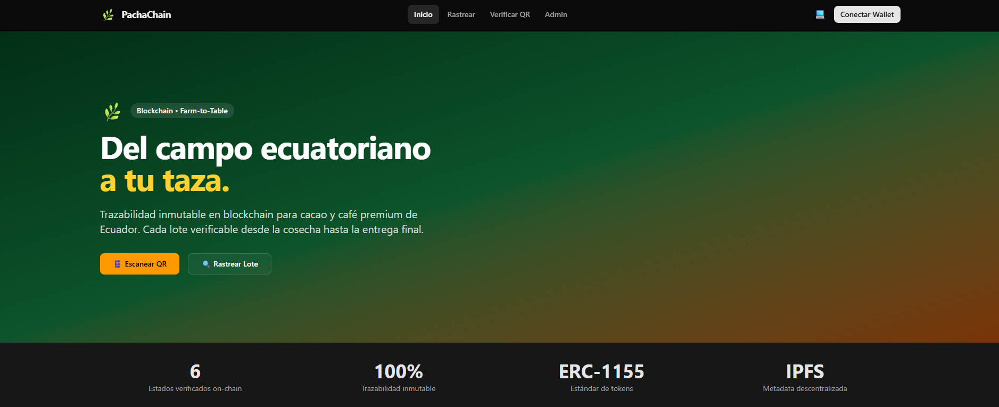
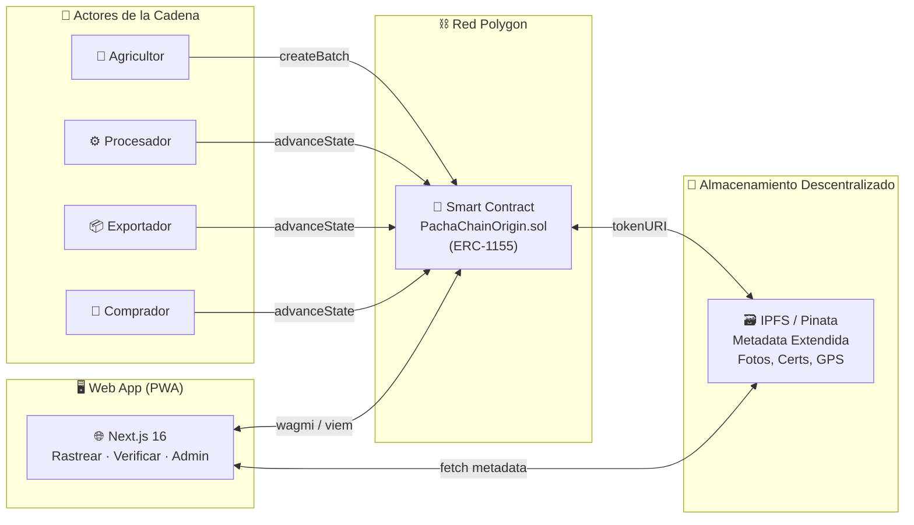
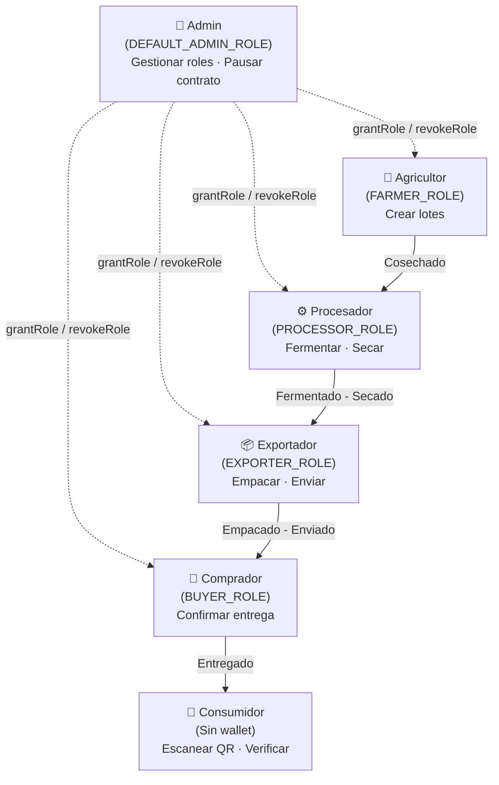
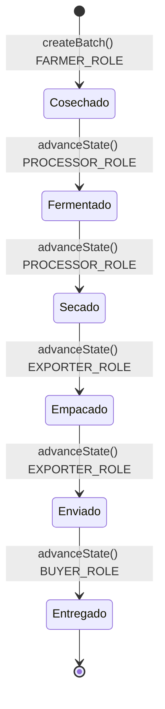
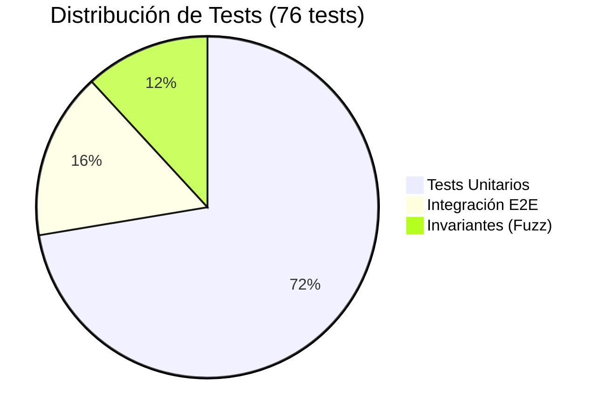
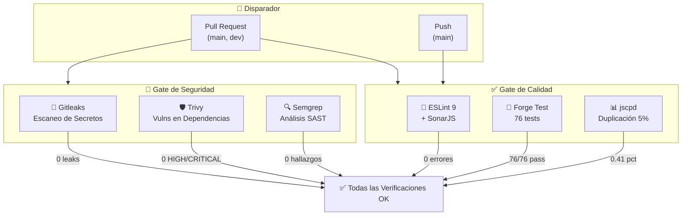
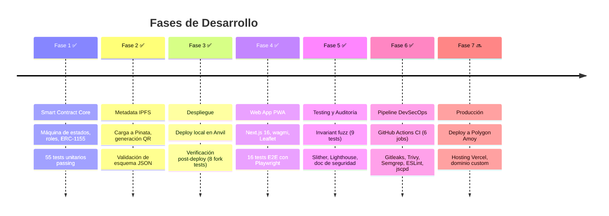

<div align="center">

# 🌿 Pacha-Chain-Origin

### Trazabilidad Farm-to-Table para Cacao y Café Premium de Ecuador

[](https://polyformproject.org/licenses/noncommercial/1.0.0/)
[](https://soliditylang.org/)
[](https://nextjs.org/)
[](https://getfoundry.sh/)
[](https://amoy.polygonscan.com/)
[](https://www.openzeppelin.com/)

[](https://github.com/KRSNA-BLR/Pacha-Chain-Origin/actions)
[](#-testing)
[](#-testing)
[](#-auditor%C3%ADa-lighthouse)

**Transparencia en cadena de suministro impulsada por blockchain para exportaciones agrícolas ecuatorianas.**
**Construido sobre el estándar multi-token ERC-1155 con cumplimiento GS1 Global Traceability.**

[Documentación](docs/) · [Arquitectura](docs/ARCHITECTURE.md) · [Auditoría de Seguridad](docs/SECURITY.md)

</div>

---

<div align="center">
  
  <br/>
  <sub>Interfaz de trazabilidad PWA — escanea un código QR y rastrea el viaje completo de tu producto</sub>
</div>

---

## 📑 Tabla de Contenidos

- [Acerca del Proyecto](#-acerca-del-proyecto)
- [Arquitectura del Sistema](#-arquitectura-del-sistema)
- [Máquina de Estados](#-máquina-de-estados)
- [Stack Tecnológico](#-stack-tecnológico)
- [Estructura del Proyecto](#-estructura-del-proyecto)
- [Inicio Rápido](#-inicio-rápido)
- [Testing](#-testing)
- [Pipeline DevSecOps](#-pipeline-devsecops)
- [Auditoría Lighthouse](#-auditoría-lighthouse)
- [Hoja de Ruta](#-hoja-de-ruta)
- [Autor](#-autor)
- [Licencia](#-licencia)

---

## 📖 Acerca del Proyecto

La cadena de suministro del cacao y café premium de Ecuador enfrenta desafíos críticos:

| Desafío | Impacto |
|---------|---------|
| 🔍 **Fraude de Origen** | Producto de baja calidad vendido como "premium ecuatoriano" |
| 🌫️ **Falta de Transparencia** | El consumidor final no puede verificar el origen real |
| 🔗 **Intermediarios Opacos** | Cada intermediario añade opacidad a la cadena |
| 💰 **Pérdida de Valor** | Los productores no capturan el valor de su trabajo |

**Pacha-Chain-Origin** resuelve esto creando una **pista de auditoría inmutable on-chain** donde cada actor de la cadena de suministro **firma criptográficamente** cada transición de estado — desde la cosecha hasta la entrega final.

> **"Pacha"** — Del quechua *Pachamama* (Madre Tierra), honrando las raíces ecuatorianas
> **"Chain"** — Blockchain + Cadena de suministro
> **"Origin"** — Trazabilidad hasta el origen exacto del producto

### Características Principales

- 🔐 **Control de Acceso por Roles** — 5 roles distintos (Farmer, Processor, Exporter, Buyer, Admin)
- 📦 **ERC-1155 Multi-Token** — Cada lote es un token único con metadata individual
- 🔄 **Máquina de Estados On-Chain** — 6 estados secuenciales, unidireccional, criptográficamente enforced
- 🌐 **Cumplimiento Estándar GS1** — Elementos WHO, WHAT, WHERE, WHEN, WHY mapeados a blockchain
- 📂 **Metadata IPFS** — Datos extendidos en IPFS (Pinata), vinculados on-chain via `ERC1155URIStorage`
- 📱 **Verificación por QR** — Escanea y rastrea cualquier lote desde tu dispositivo móvil
- 🗺️ **Mapa Interactivo de Origen** — Mapa georeferenciado con Leaflet de 20+ regiones ecuatorianas
- ⏸️ **Pausa de Emergencia** — Patrón circuit breaker para respuesta a incidentes
- 🎨 **PWA Premium** — Next.js 16, modo Dark/Light, animaciones Framer Motion, mobile-first

---

## 🏗 Arquitectura del Sistema

### Flujo End-to-End



### Modelo de Roles (GS1 "One Step Up, One Step Down")



---

## 🔄 Máquina de Estados

Cada lote sigue una **máquina de estados estrictamente unidireccional** — sin saltos, sin retrocesos.



| Propiedad | Garantía |
|-----------|----------|
| **Unidireccional** | El estado solo avanza — `newState == currentState + 1` |
| **Secuencial** | No se permite saltar estados |
| **Permisionado** | Cada transición requiere un rol específico |
| **Inmutable** | Una vez registrada, la transición no se puede deshacer |
| **Auditable** | Cada transición emite un evento con timestamp y firmante |

---

## 🛠 Stack Tecnológico

### Capa de Smart Contract

| Tecnología | Versión | Propósito |
|------------|---------|-----------|
| **Solidity** | ^0.8.24 | Lenguaje de smart contracts |
| **Foundry** | Última | Framework de desarrollo (forge, cast, anvil) |
| **OpenZeppelin** | 5.x | Primitivas de seguridad (ERC1155, AccessControl, Pausable) |
| **EVM** | Cancun | Versión EVM objetivo |
| **Polygon Amoy** | Testnet | Red de despliegue objetivo |

### Capa Frontend

| Tecnología | Versión | Propósito |
|------------|---------|-----------|
| **Next.js** | 16.1.6 | Framework React full-stack (App Router, SSR/SSG) |
| **React** | 19.2.3 | Librería de interfaz de usuario |
| **TypeScript** | 5.x | Desarrollo con tipado seguro |
| **Tailwind CSS** | 4.x | Framework CSS utility-first |
| **shadcn/ui** | Última | Librería de componentes UI accesibles |
| **wagmi** | 3.x | React hooks para Ethereum |
| **viem** | 2.x | Interfaz TypeScript para Ethereum |
| **Framer Motion** | Última | Animaciones y transiciones de página |
| **React Leaflet** | 5.x | Mapa interactivo de origen |
| **Playwright** | Última | Testing E2E en navegador |

### DevSecOps

| Herramienta | Propósito |
|-------------|-----------|
| **GitHub Actions** | Pipeline CI/CD (6 jobs) |
| **Gitleaks** | Escaneo de secretos |
| **Trivy** | Escaneo de vulnerabilidades en dependencias |
| **Semgrep** | Análisis estático de seguridad (SAST) |
| **ESLint 9 + SonarJS** | Calidad de código y linting |
| **jscpd** | Detección de código duplicado (umbral 5%) |

---

## 📂 Estructura del Proyecto

```
Pacha-Chain-Origin/
├── src/                          # Código fuente Solidity
│   ├── PachaChainOrigin.sol      #   Contrato principal (ERC-1155 + AccessControl)
│   ├── interfaces/               #   Interfaz del contrato (IPachaChainOrigin)
│   └── libraries/                #   Librería BatchIdGenerator
├── test/                         # Tests de Foundry (76 passing)
│   ├── PachaChainOrigin.t.sol    #   55 tests unitarios (incl. fuzz)
│   ├── PachaChainOrigin.e2e.t.sol#   12 tests de integración E2E
│   ├── PachaChainOrigin.invariant.t.sol  # 9 tests de invariantes
│   └── PostDeployVerification.t.sol      # Tests de verificación fork
├── script/                       # Scripts de deployment Foundry
├── frontend/                     # PWA con Next.js 16
│   ├── src/app/                  #   Páginas del App Router
│   ├── src/components/           #   40+ componentes React
│   ├── src/hooks/                #   Hooks de contrato wagmi
│   ├── src/config/               #   ABI y direcciones del contrato
│   └── e2e/                      #   Tests E2E con Playwright (16)
├── docs/                         # Documentación del proyecto
│   ├── ARCHITECTURE.md           #   Arquitectura del sistema
│   ├── DEPLOYMENT.md             #   Guía de despliegue
│   ├── GS1-MAPPING.md            #   Mapeo estándar GS1
│   ├── PHASES.md                 #   Fases de desarrollo
│   └── SECURITY.md               #   Auditoría de seguridad
├── scripts/                      # Scripts utilitarios Node.js
│   ├── upload-to-pinata.mjs      #   Carga de metadata a IPFS
│   ├── generate-qr.mjs          #   Generación de códigos QR
│   └── validate-metadata.mjs    #   Validación de esquema JSON
├── metadata/                     # Esquemas de metadata compatibles GS1
├── deployments/                  # Exportaciones ABI y direcciones
├── .github/                      # Configuración CI/CD y DevSecOps
│   ├── workflows/ci.yml         #   Pipeline GitHub Actions
│   ├── .gitleaks.toml           #   Reglas de escaneo de secretos
│   └── .jscpd.json              #   Umbrales de duplicación
└── lib/                          # Submódulos Git (OZ, forge-std)
```

---

## 🚀 Inicio Rápido

### Requisitos Previos

| Herramienta | Instalación |
|-------------|-------------|
| **Foundry** | `curl -L https://foundry.paradigm.xyz \| bash && foundryup` |
| **Node.js** | v20+ — [nodejs.org](https://nodejs.org/) |
| **Git** | [git-scm.com](https://git-scm.com/) |

### 1. Clonar e Instalar

```bash
git clone https://github.com/KRSNA-BLR/Pacha-Chain-Origin.git
cd Pacha-Chain-Origin

# Instalar dependencias del frontend
cd frontend && npm install && cd ..
```

### 2. Compilar y Testear Smart Contracts

```bash
# Compilar
forge build

# Ejecutar todos los tests (76 passing)
forge test -vv

# Ejecutar con reporte de gas
forge test --gas-report
```

### 3. Desplegar Localmente (Anvil)

```bash
# Terminal 1: Iniciar blockchain local
anvil --host 127.0.0.1 --port 8545

# Terminal 2: Desplegar
export PRIVATE_KEY=0xac0974bec39a17e36ba4a6b4d238ff944bacb478cbed5efcae784d7bf4f2ff80
forge script script/Deploy.s.sol:DeployPachaChainOrigin \
  --rpc-url http://127.0.0.1:8545 --broadcast -vvvv
```

### 4. Iniciar Frontend

```bash
cd frontend
npm run dev
# Abrir http://localhost:3000
```

> 📖 Para instrucciones completas de despliegue (Polygon Amoy, configuración de roles, verificación post-deploy), ver **[docs/DEPLOYMENT.md](docs/DEPLOYMENT.md)**.

---

## 🧪 Testing

### Tests de Smart Contract



| Suite | Archivo | Tests | Estado |
|-------|---------|------:|--------|
| Tests Unitarios | `PachaChainOrigin.t.sol` | 55 | ✅ Pass |
| Integración E2E | `PachaChainOrigin.e2e.t.sol` | 12 | ✅ Pass |
| Invariantes (Fuzz) | `PachaChainOrigin.invariant.t.sol` | 9 | ✅ Pass |
| Fork Post-Deploy | `PostDeployVerification.t.sol` | 1 | ⏭️ Skip (requiere env) |
| **Total** | **4 suites** | **76** | **✅ Todos passing** |

### Cobertura de Código

| Archivo | Líneas | Sentencias | Funciones |
|---------|-------:|-----------:|----------:|
| `PachaChainOrigin.sol` | **97.22%** | **94.81%** | **100%** |
| `BatchIdGenerator.sol` | **100%** | **100%** | **100%** |

### Propiedades Invariantes Verificadas

| ID | Propiedad | Descripción |
|----|-----------|-------------|
| INV-01 | Contador de Lotes | `totalBatches == conteo real de lotes creados` |
| INV-02 | Supply = 1 | Cada lote mintea exactamente 1 token |
| INV-03 | Estado Monotónico | El estado solo avanza, nunca retrocede |
| INV-04 | Farmer Inmutable | La dirección `farmer` nunca cambia después de creación |
| INV-05 | Estado en Rango | El estado siempre está en `[0, 5]` |
| INV-06 | Sin Supply Fantasma | Tokens inexistentes tienen supply = 0 |
| INV-07 | Sin ETH Bloqueado | El contrato nunca retiene Ether |

### Tests E2E Frontend (Playwright)

| Suite | Tests | Estado |
|-------|------:|--------|
| Landing Page | 5 | ✅ |
| Página de Rastreo | 3 | ✅ |
| Panel Admin | 2 | ✅ |
| Verificación QR | 1 | ✅ |
| Página 404 | 1 | ✅ |
| Headers de Seguridad | 1 | ✅ |
| Accesibilidad | 3 | ✅ |
| **Total** | **16** | **✅ Todos passing** |

---

## 🔒 Pipeline DevSecOps

El pipeline CI ejecuta **6 jobs en paralelo** en cada pull request:



| Herramienta | Alcance | Resultado |
|-------------|---------|-----------|
| **Gitleaks** | Detección de secretos | 0 leaks |
| **Trivy** | Vulns HIGH/CRITICAL | 0 encontradas |
| **Semgrep** | SAST (ruleset p/ci) | 0 hallazgos |
| **ESLint 9** | Calidad de código | 0 errores |
| **Forge Test** | Tests de smart contract | 76/76 pass |
| **jscpd** | Duplicación de código | 0.41% (umbral: 5%) |

---

## 📊 Auditoría Lighthouse

| Métrica | Puntaje |
|---------|--------:|
| ⚡ Rendimiento | **85** |
| ♿ Accesibilidad | **98** |
| 🏆 Mejores Prácticas | **96** |
| 🔎 SEO | **100** |

---

## 🗺 Hoja de Ruta



---

## 📄 Documentación

| Documento | Descripción |
|-----------|-------------|
| [ARCHITECTURE.md](docs/ARCHITECTURE.md) | Arquitectura detallada, modelo de actores, estructuras de datos |
| [DEPLOYMENT.md](docs/DEPLOYMENT.md) | Guía paso a paso de despliegue (Anvil + Polygon Amoy) |
| [GS1-MAPPING.md](docs/GS1-MAPPING.md) | Mapeo del estándar GS1 Global Traceability a blockchain |
| [PHASES.md](docs/PHASES.md) | Registro completo de fases de desarrollo con entregables |
| [SECURITY.md](docs/SECURITY.md) | Auditoría de seguridad: control de acceso, máquina de estados, vectores de ataque |

---

## 👤 Autor

<div align="center">

**Danilo Viteri Moreno**

[](https://github.com/KRSNA-BLR)
[](https://www.linkedin.com/in/danilo-viteri-moreno)
[](https://kbasesorias.com/)
[](mailto:dannyviterimoreno@gmail.com)

☁️ DevOps & Cloud Engineer · 🤖 AI Automation · AWS & Azure · IaC · CI/CD · 🌐 Full Stack

**KBASESORIAS** · Ecuador 🇪🇨

</div>

---

## 📜 Licencia

Distribuido bajo la **PolyForm Noncommercial License 1.0.0** — puedes usar, modificar y distribuir este software **únicamente con fines no comerciales**. Ver [LICENSE](LICENSE) para el texto completo.

---

<div align="center">

**Construido con 🌿 por [Danilo Viteri Moreno](https://github.com/KRSNA-BLR) — Ecuador 🇪🇨**

*Trazabilidad. Transparencia. Confianza.*

⬆️ [Volver arriba](#-pacha-chain-origin)

</div>
